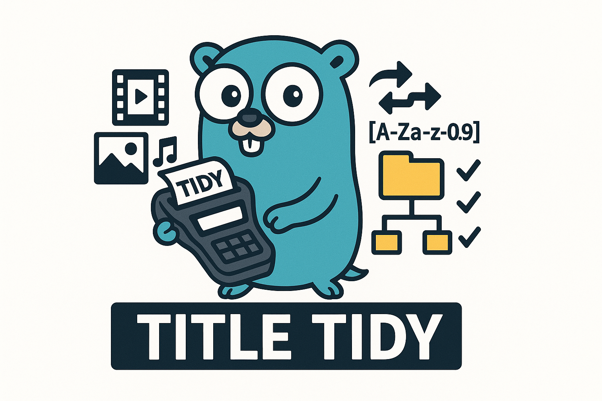

<div align="center">
  
</div>

Title tidy is the quickest way to standardizes your media file names for use in Jellyfin, Plex, and Emby. Title tidy uses
intelligent parsing of folder structures and file names to automatically determine exactly how to name media. Whether you
need to rename a single episode, a whole season, or any number of shows, Title Tidy does the job in one command. A preview
is shown before renaming occurs, and Title Tidy will never overwrite content. 

The tool scans your current directory and displays an interactive preview showing exactly what will be renamed. The tool
reliably detects season and episode numbers across various formats (S01E01, 1x01, 101, etc.) and handles edge cases well.
Green items indicate pending changes. You can navigate through the list and apply changes when ready.

## Table of Contents

- [Basic Usage](#basic-usage)
- [Commands](#commands)
  - [Config](#config)
  - [Shows](#shows)
  - [Seasons](#seasons)
  - [Episodes](#episodes)
  - [Movies](#movies)
- [Installation](#installation)
  - [Go Install (Recommended)](#go-install)
  - [Docker](#docker)
- [Built With](#built-with)
- [Contributing](#contributing)
- [License](#license)
- [Star History](#star-history)

## How to Use It

The tool provides four main commands, each designed for different scenarios. Run it in the directory containing your
media files, and you'll see a preview of all proposed changes. Nothing gets renamed until you confirm.

### Basic Usage

```bash
title-tidy [command]
```

* Add the `-i` or `--instant` flag to apply changes immediately without the interactive preview.
* The `--no-nfo` flag will delete nfo files during the rename process.
* The `--no-img` flag will delete image files during the rename process.
* The `--link [DESTINATION]` flag will cause title-tidy to hard link files into the destination instead of renaming files in place. Use this if you are still seeding media files, but want to move them into your organized media.

## Commands

### Config

```bash
title-tidy config
```

Title Tidy allows you to completely customize how your media files are named using configurable templates:


This opens an interactive interface where you can customize the naming templates for:
* **Show folders**: How TV show directories are named (default: `{show} ({year})`)
* **Season folders**: How season directories are named (default: `{season_name}`)
* **Episode files**: How individual episodes are named (default: `{season_code}{episode_code}`)
* **Movie folders**: How movie directories are named (default: `{movie} ({year})`)

**Available template variables:**
* `{show}` - Show name (cleaned)
* `{movie}` - Movie name (cleaned)  
* `{year}` - Year from filename
* `{season}` - Season number (e.g., "01")
* `{season_code}` - Season with prefix (e.g., "S01")
* `{season_name}` - Full season name (e.g., "Season 01")
* `{episode}` - Episode number (e.g., "01")
* `{episode_code}` - Episode with prefix (e.g., "E01")

**Template examples:**
* `{show} - {season_code}{episode_code}` → "Breaking Bad - S01E01"
* `{season_name}` → "Season 01"
* `{movie} [{year}]` → "The Matrix [1999]"

Your custom templates are saved to `~/.title-tidy/config.json` and will be used for all future renames.

### Shows

```bash
title-tidy shows
```

Use this when you have one or more complete TV shows with multiple seasons and episodes. It handles
the entire directory structure: show folders, season folders, and all episode files within. This
command can process multiple shows at once. Episode files named only after the episode
will retrieve the season number from the parent directory name. 


**Before → After examples:**
```
My.Cool.Show.2024.1080p.WEB-DL.x264/                → My Cool Show (2024)/
├── Season 1/                                       → ├── Season 01/
│   ├── Show.Name.S01E01.1080p.mkv                  → │   ├── S01E01.mkv
│   └── show.name.s01e02.mkv                        → │   └── S01E02.mkv
│   └── Show.Name.1x03.mkv                          → │   └── S01E03.mkv
│   └── 1.04.1080p.mkv                              → │   └── S01E04.mkv
├── s2/                                             → ├── Season 02/
│   ├── Episode 5.mkv                               → │   ├── S02E05.mkv
│   └── E06.mkv                                     → │   └── S02E06.mkv
├── Season_03 Extras/                               → ├── Season 03/
│   ├── Show.Name.S03E01.en.srt                     → │   ├── S03E01.en.srt
│   ├── Show.Name.S03E01.en-US.srt                  → │   ├── S03E01.en-US.srt
│   └── Show.Name.S03E02.srt                        → │   └── S03E02.srt
│   └── 10.12.mkv                                   → │   └── S10E12.mkv
Another-Show-2023-2024-2160p/                       → Another Show (2023-2024)/
├── Season-1/                                       → ├── Season 01/
│   ├── Show.Name.S01E01.mkv                        → │   ├── S01E01.mkv
│   └── Show.Name.1x02.mkv                          → │   └── S01E02.mkv
├── Season-2/                                       → ├── Season 02/
│   └── 2.03.mkv                                    → │   └── S02E03.mkv
Plain Show/                                         → Plain Show/
├── 5/                                              → ├── Season 05/
│   ├── Show.Name.S05E01.mkv                        → │   ├── S05E01.mkv
│   └── Episode 2.mkv                               → │   └── S05E02.mkv
Edge.Show/                                          → Edge Show/
├── Season 0/                                       → ├── Season 00/
│   └── S00E00.mkv                                  → │   └── S00E00.mkv
```

### Seasons

```bash
title-tidy seasons
```

Perfect when adding a new season to an existing show directory. Episode files named only after the episode
will retrieve the season number from the directory name. 


**Before → After examples:**
```
Season_02_Test/                                     → Season 02/
├── Show.Name.S02E01.1080p.mkv                      → ├── S02E01.mkv
├── Show.Name.1x02.mkv                              → ├── S02E02.mkv
├── 2.03.mkv                                        → ├── S02E03.mkv
├── Episode 4.mkv                                   → ├── S02E04.mkv
├── E05.mkv                                         → ├── S02E05.mkv
└── Show.Name.S02E06.en.srt                         → └── S02E06.en.srt
```

### Episodes

```bash
title-tidy episodes
```

Sometimes you have a collection of episode files in a folder. No season directory, no show folder, just files.
This command renames each episode file based on the season and episode information found in the filename.


**Before → After examples:**
```
Show.Name.S03E01.mkv                               → S03E01.mkv
show.name.s03e02.mkv                               → S03E02.mkv
3x03.mkv                                           → S03E03.mkv
3.04.mkv                                           → S03E04.mkv
Show.Name.S03E07.en-US.srt                         → S03E07.en-US.srt
```

### Movies

```bash
title-tidy movies
```

Movies receive special handling. Standalone movie files automatically get their own directories, while movies already in
folders have both the folder and file names cleaned up. Subtitles remain properly paired with their movies, maintaining
language codes.


**Before → After examples:**
```
Another.Film.2023.720p.BluRay.mkv                  → Another Film (2023)/
                                                   → └── Another Film (2023).mkv
Plain_Movie-file.mp4                               → Plain Movie-file/
                                                   → └── Plain Movie-file.mp4
EdgeCase.Movie.2021.mkv                            → EdgeCase Movie (2021)/
EdgeCase.Movie.2021.en.srt                         → ├── EdgeCase Movie (2021).mkv
                                                   → └── EdgeCase Movie (2021).en.srt
Great.Movie.2024.1080p.x265/                       → Great Movie (2024)/
├── Great.Movie.2024.1080p.x265.mkv                → ├── Great Movie (2024).mkv
├── Great.Movie.2024.en.srt                        → ├── Great Movie (2024).en.srt
├── Great.Movie.2024.en-US.srt                     → ├── Great Movie (2024).en-US.srt
Some Film (2022)/                                  → Some Film (2022)/
├── Some.Film.2022.1080p.mkv                       → ├── Some Film (2022).mkv
```

## Installation

### Go Install

The recommended way to install Title Tidy is using Go. This provides the best performance and easiest usage.

#### Installing Go

**For Windows:**
1. Visit [https://go.dev/dl/](https://go.dev/dl/)
2. Download the Windows installer (usually ends with `.msi`)
3. Run the installer and follow the prompts
4. Restart your computer after installation

**For macOS:**
1. Install [Homebrew](https://brew.sh/)
2. Run `brew install go` in your terminal

**For Linux:**
1. Visit [https://go.dev/dl/](https://go.dev/dl/)
2. Download the Linux tarball for your architecture
3. Extract and install.

#### Installing Title Tidy

Once Go is installed, you can install Title Tidy with a single command:

```bash
go install github.com/Digital-Shane/title-tidy@latest
```

### Docker

For containerized environments or if you prefer not to install Go, you can use Docker:

```bash
# Pull the latest image
docker pull digitalnal/title-tidy:latest

# Run a command (replace /path/to/your/media with your actual media directory)
docker run -v /path/to/your/media:/app/media -w /app/media digitalnal/title-tidy:latest title-tidy shows
```

#### Docker Compose

For repeated usage, you can use Docker Compose for easy interactive access:

```yaml
services:
  title-tidy:
    image: digitalnal/title-tidy:latest
    volumes:
      - ./media:/app/media
    working_dir: /app/media
    entrypoint: ["/bin/sh"]
```

Then run:
```bash
# Drop into an interactive shell in the container
docker-compose run --rm title-tidy

# Once inside the container, you can run title-tidy commands directly:
# title-tidy shows
# title-tidy seasons  
# title-tidy episodes
# exit
```

#### Building Locally

You can also build the Docker image locally:

```bash
docker build -t title-tidy .
docker run -v /path/to/your/media:/app/media -w /app/media title-tidy title-tidy shows
```

## Built With

This project is built using my [treeview](https://github.com/Digital-Shane/treeview) library, which provides
powerful tree structure visualization and manipulation capabilities in the terminal.

## Contributing

Contributions are welcome! If you have any suggestions or encounter a bug, please open an
[issue](https://github.com/Digital-Shane/title-tidy/issues) or submit a pull request.

When contributing:

1. Fork the repository and create a new feature branch
2. Make your changes in a well-structured commit history
3. Include tests (when applicable)
4. Submit a pull request with a clear description of your changes

## License

This project is licensed under the GNU Version 3 - see the [LICENSE](./LICENSE) file for details.

## Star History

[](https://www.star-history.com/#Digital-Shane/title-tidy&Date)
